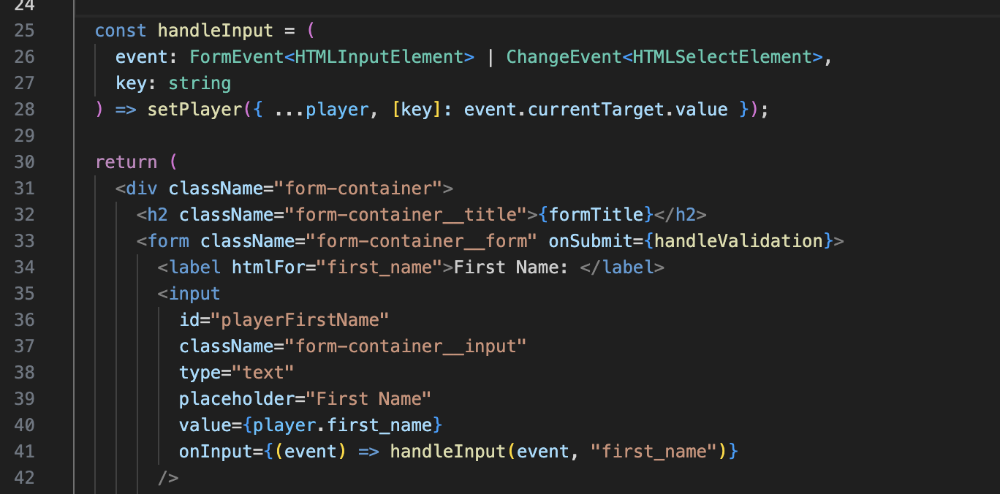

# Locker-Room FullStack Project

> Locker-Room is a database of premier league players featuring information created in tables from MySQL.

This project was completed over a week and included the task of creating a back-end database that interacts with the front-end to bring you the latest data regarding the current players.

## Features

- View Player Data: Access and view detailed information about Premier League players.
- Create Your Player: Create and add a new player to the database with the desired details.
- Search Functionality: Search and filter through player data to find specific players based on various criteria.
- Delete Player Data: Remove a player's data from the database.

## Code-Snippets

- onInput is a React event attribute that triggers whenever there is new input in the associated input field.

(event) => handleInput(event, "first_name") is an arrow function that gets executed whenever the onInput event is triggered. It calls the handleInput function and passes two arguments:

event: The event object containing information about the input event.
"first_name": A string representing the key (property) that needs to be updated in the player state.
handleInput function updates the state of the player by using setPlayer to merge the existing player state with the new value of the input field. The key being updated is specified by the string passed ("first_name", "last_name", etc.).

In summary, onInput event is used to call the handleInput function and update the respective property of the player state whenever the user types or modifies content in the input fields.
